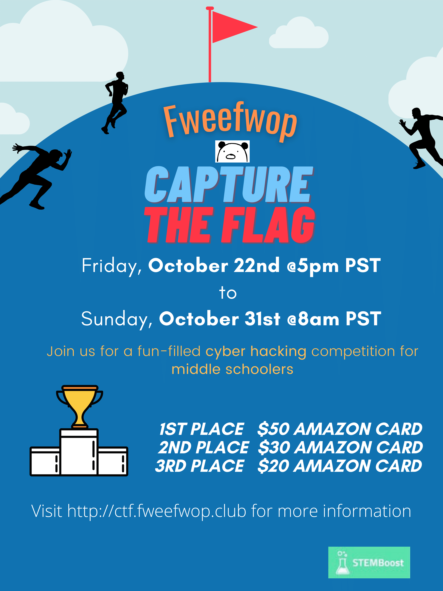

+++
title = "Welcome to Fweefwop"
description = "Welcome to Fweefwop"
+++   
###  Update
--------------------------------
**Congradulations to our Fweefwop team for winning NoQRTR CTF!**     
NoQRTR CTF is hosted by [@HackersPacific](https://twitter.com/HackersPacific) [Pacific Hackers](https://www.phack.org/) Conferences!       

**Team Members:** Arthur Perng, Joshua Zhang, Ryan Tan, Brian Deng, Andrea Perng      
(https://twitter.com/rodsoto)

--------------------------------
**Fweefwop CTF 2021** has ended. Thanks for you participation!

Thanks to [ctfd.io](https://ctfd.io/)'s generous support, we will keep our [ctf server](https://ctf.fweefwop.club) up after this CTF. New problems will be added from time to time.    

This CTF is as much of an endeavor to us as it is to you. When we started this competition, we were only expecting a few people to sign up, mostly locals. But you exceeded our every expectation! We had more than 500 people register, which is incredible. It's amazing to see how many people are dedicated to the study of cybersecurity and willing to share and expand their knowledge. Many people joined online from all over the world, including Spain, Ireland, Russia, Bangladesh, India, China, and Korea, which blows our mind. Thank you!   

#### Credits: 
Thanks for the following cyber security content writers:     
**Arthur Perng** (RE, Linux, OSINT)     
**Eric Ju** (Crypto, Forensics)      
**Joshua Zhang** (Web)     
**Elli Stoyanova** (Web)    
**Anish Bayyapu** (Crypto, OSINT)     
**Brain Deng** (Crypto, Forensics)    
**Ryan Tan** (Forensics)         

Special Thanks to **Michael Smith** for his help in infrastructure system design.     
                                      
---------------------------
                   

### Held in collaboration with STEMBoost ###
Welcome to FweefwopCTF! FweefwopCTF starts **October 22, 2021** and will end on **October 31, 2021**. It will be held online. 

#### What is a CTF? ####
A CTF (“capture-the-flag”) competition is a type of cybersecurity competition where contenders can solve problems and answer questions in exchange for “flags.” Flags are pieces of text that can be submitted for points, and look something like “fwop{this_is_a_flag}.”
#### When is it? ####
FweefwopCTF will be held October 22-31, 2021.
#### How can I join? ####
Register here: http://ctf.fweefwop.club/register.         

-----------------------------              
### About US  

Established in 2019, Fweefwop started out as a student-run club that fostered our common passion for cybersecurity.       
                   
Our goal is to keep an active interest in cyber-related fields and provide our community with the tools and awareness they need to stay safe and secure in our computer-dominated world. We want to provide a friendly environment that invites all interested to participte and increase their knowledge of computer and informatics by practicing skill in club activities and competitions, including but not limited to picoCTF, CSAW, redPWN and other CTFs.

#### Meetings ####
                             
Our weekly meetings are on **Sundays from 2:00-4:00pm (PST) online**.                                     
Send us an email at **fweefwopcyber@gmail.com** to join. 
